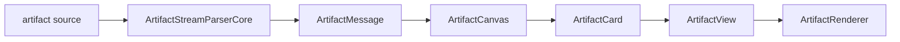
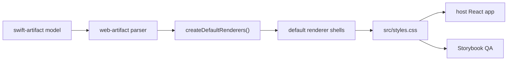

# web-artifact

React component library for rendering LLM-generated `<artifact>` blocks.

`web-artifact` is the React/web counterpart to `swift-artifact`. It keeps the
artifact parsing and renderer-registration model aligned where possible, while
using browser-native rendering surfaces for output that can be represented on
the web. Native-only surfaces from `swift-artifact` are intentionally outside
the initial renderer set until a web renderer contract is defined for them.



## Usage

```tsx
import {
  ArtifactCanvas,
  ArtifactProvider,
  createDefaultRenderers,
  parseArtifactMessage,
} from "web-artifact";
import "web-artifact/styles.css";

const message = parseArtifactMessage(source);

export function MessageArtifactView() {
  return (
    <ArtifactProvider renderers={createDefaultRenderers()}>
      <ArtifactCanvas message={message} />
    </ArtifactProvider>
  );
}
```

## Renderer contract

Renderers are registered by MIME type. `Component` receives only the refined
payload, not the raw streaming payload.

```tsx
import type { ArtifactRenderer } from "web-artifact";
import { preRenderable, renderable } from "web-artifact";

export const textRenderer: ArtifactRenderer = {
  id: "text",
  artifactTypes: ["text/plain"],
  refine(artifact) {
    if (!artifact.payload && !artifact.isComplete) {
      return preRenderable({
        receivedCharacters: 0,
        hint: "waiting for text",
      });
    }
    return renderable(artifact.payload);
  },
  chrome: {
    preferredContentInsets: "default",
    surface: "text",
  },
  Component({ payload }) {
    return <pre>{payload}</pre>;
  },
};
```

## Included renderers

| Group | Renderers |
|---|---|
| Basic | Markdown, JSON, CSV, Code, SVG |
| Sandbox | HTML, React, Mermaid, LaTeX, Vega-Lite |

Sandbox renderers use `iframe srcDoc` without `allow-same-origin`.

## Default rendering behavior

Renderer presentation defaults live in package code, not in Storybook-only
fixtures. Host applications get these defaults by importing
`web-artifact/styles.css` and using `createDefaultRenderers()`.



Current defaults include:

| Area | Default |
|---|---|
| Card chrome | Compact header, edge-aligned scroll areas, collapsible cards |
| Markdown | GFM tables, task lists, blockquotes, code blocks, inline code, links |
| Code | Line numbers and diff line coloring |
| Sandbox | Auto-sized iframe height and renderer-specific content padding |
| Mermaid | Diagrams scale to card width |
| Vega-Lite | Missing `width` and `autosize` are filled for responsive charts |

## Visual inspection

Storybook includes a renderer gallery and single-renderer stories. These stories
exercise the package defaults above; visual fixes should generally be made in
`src` so host applications receive the same behavior.

```bash
npm run storybook
npm run build:storybook
```

Open `http://127.0.0.1:6006/?path=/story/web-artifact-renderers--gallery`
to inspect the current renderer set.
