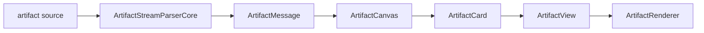
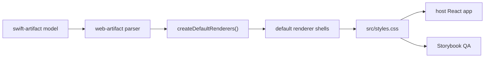
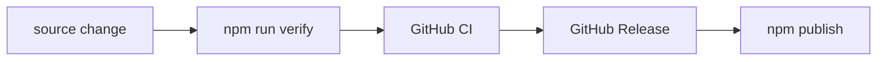

# web-artifact

React component library for rendering LLM-generated `<artifact>` blocks.

`web-artifact` is the React/web counterpart to `swift-artifact`. It keeps the
artifact parsing and renderer-registration model aligned where possible, while
using browser-native rendering surfaces for output that can be represented on
the web. Native-only surfaces from `swift-artifact` are intentionally outside
the initial renderer set until a web renderer contract is defined for them.



## Usage

Install the package in the host React app, import the shared stylesheet once,
parse the agent output into an `ArtifactMessage`, and render that message inside
an `ArtifactProvider`.

```tsx
import {
  ArtifactCanvas,
  ArtifactProvider,
  createDefaultRenderers,
  parseArtifactMessage,
} from "web-artifact";
import "web-artifact/styles.css";

const message = parseArtifactMessage(source);

export function MessageArtifactView() {
  return (
    <ArtifactProvider renderers={createDefaultRenderers()}>
      <ArtifactCanvas message={message} />
    </ArtifactProvider>
  );
}
```

For streaming output, keep one parser instance per message and feed incoming
chunks into it. Render the latest `snapshot()` or returned message after each
chunk.

```ts
import { ArtifactStreamParserCore } from "web-artifact";

const parser = new ArtifactStreamParserCore();

for await (const chunk of stream) {
  const message = parser.feed(chunk);
  render(message);
}
```

## Agent output contract

Agents should emit ordinary prose and artifact blocks in the same text stream.
The parser preserves prose as text segments and converts artifact blocks into
renderable artifact segments.

Artifact blocks use this shape:

```text
<artifact identifier="{stable-id}" type="{mime-type}" title="{display-title}">
{payload}
</artifact>
```

Agent requirements:

| Requirement | Contract |
|---|---|
| `type` | Required MIME type used for renderer resolution |
| `identifier` | Stable identifier for the artifact within the message |
| `title` | Short display title for card chrome |
| payload | Raw renderer payload, not wrapped in an extra Markdown code fence |
| surrounding prose | Put explanation outside the artifact block |
| streaming | Open the tag before payload, stream payload bytes, close the tag when complete |

Web-compatible MIME types currently rendered by `createDefaultRenderers()`:

| MIME type | Agent payload contract |
|---|---|
| `text/markdown` | GitHub-flavored Markdown content |
| `application/json` | Valid JSON value |
| `text/csv` | CSV text with a header row when tabular |
| `application/vnd.ant.code` | Source code or unified diff text |
| `image/svg+xml` | Complete SVG markup |
| `text/html` | HTML document or fragment for iframe rendering |
| `application/vnd.ant.react` | React component source that can mount in the sandbox |
| `application/vnd.ant.mermaid` | Mermaid diagram source |
| `application/x-latex` | LaTeX expression |
| `application/vnd.vegalite.v5+json` | Vega-Lite v5 JSON spec |

When aligning prompts with `swift-artifact`, keep the shared artifact tag model
and MIME-type routing, but only request MIME types that have a web renderer in
this package. Native-only `swift-artifact` surfaces should not be emitted unless
the host app has registered a compatible web renderer.

## Renderer contract

Renderers are registered by MIME type. `Component` receives only the refined
payload, not the raw streaming payload.

```tsx
import type { ArtifactRenderer } from "web-artifact";
import { preRenderable, renderable } from "web-artifact";

export const textRenderer: ArtifactRenderer = {
  id: "text",
  artifactTypes: ["text/plain"],
  refine(artifact) {
    if (!artifact.payload && !artifact.isComplete) {
      return preRenderable({
        receivedCharacters: 0,
        hint: "waiting for text",
      });
    }
    return renderable(artifact.payload);
  },
  chrome: {
    preferredContentInsets: "default",
    surface: "text",
  },
  Component({ payload }) {
    return <pre>{payload}</pre>;
  },
};
```

## Included renderers

| Group | Renderers |
|---|---|
| Basic | Markdown, JSON, CSV, Code, SVG |
| Sandbox | HTML, React, Mermaid, LaTeX, Vega-Lite |

Sandbox renderers use `iframe srcDoc` without `allow-same-origin`.

## Default rendering behavior

Renderer presentation defaults live in package code, not in Storybook-only
fixtures. Host applications get these defaults by importing
`web-artifact/styles.css` and using `createDefaultRenderers()`.



Current defaults include:

| Area | Default |
|---|---|
| Card chrome | Compact header, edge-aligned scroll areas, collapsible cards |
| Markdown | GFM tables, task lists, blockquotes, code blocks, inline code, links |
| Code | Line numbers and diff line coloring |
| Sandbox | Auto-sized iframe height and renderer-specific content padding |
| Mermaid | Diagrams scale to card width |
| Vega-Lite | Missing `width` and `autosize` are filled for responsive charts |

## Visual inspection

Storybook includes a renderer gallery and single-renderer stories. These stories
exercise the package defaults above; visual fixes should generally be made in
`src` so host applications receive the same behavior.

```bash
npm run storybook
npm run build:storybook
```

Open `http://127.0.0.1:6006/?path=/story/web-artifact-renderers--gallery`
to inspect the current renderer set.

## Development and release

Run the full local verification command before pushing changes that affect the
package surface, renderer defaults, Storybook, or release metadata.

```bash
npm run verify
```

`verify` runs type checking, unit tests, the package build, the Storybook build,
and an npm pack dry run.



CI and release automation:

| Workflow | Trigger | Responsibility |
|---|---|---|
| `CI` | Push to `main`, pull request | Run `npm run verify` |
| `Publish npm` | GitHub Release `published` | Run `npm run verify`, then publish to npm |

Release requirements:

| Requirement | Purpose |
|---|---|
| Bump `package.json` version before release | npm rejects duplicate published versions |
| Add repository secret `NPM_TOKEN` | Authenticates `npm publish` from GitHub Actions |
| Enable publish permission for the token | Allows public package publication |
| Keep `id-token: write` in the workflow | Enables npm provenance generation |

The release workflow publishes with:

```bash
npm publish --access public --provenance
```

Create and publish a GitHub Release for the commit that should be distributed.
The workflow publishes the package version contained in that commit.
